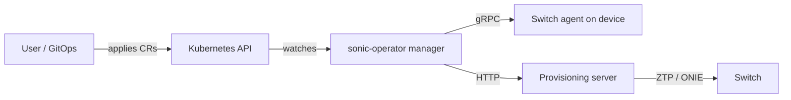

# Sonic Operator Architecture

`sonic-operator` is a Kubernetes operator that onboards and manages bare-metal network switches.

## Components

- **Controller manager** reconciles CRDs and maintains status.
- **Switch agent** runs on the device and exposes gRPC operations.
- **Provisioning server** serves ZTP scripts and ONIE artifacts over HTTP.

## High-level flow

1. A `Switch` custom resource represents a physical switch and its endpoint.
2. The controller connects to the agent and observes device state.
3. The controller creates/updates interface resources based on discovery.
4. Desired admin state is enforced on the device.

## Diagram

