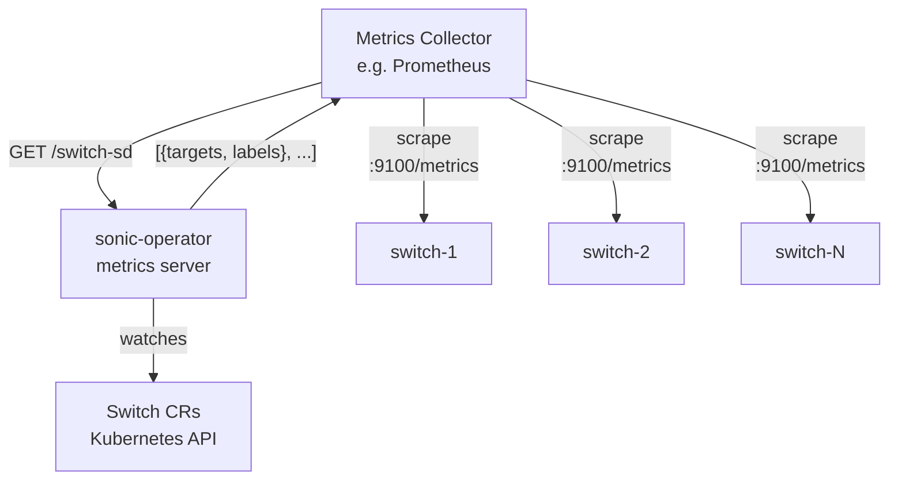

# Switch Metrics Discovery

The sonic-operator exposes an HTTP Service Discovery (SD) endpoint that enables Prometheus and compatible scrapers to automatically discover and scrape metrics from all ready switches. This eliminates the need to maintain a static list of scrape targets.

## How it works

The operator watches all `Switch` resources in the cluster. Switches that have reached the `Ready` state and have a management address configured are served as scrape targets via the `/switch-sd` endpoint on the operator's metrics server.



## Response format

The endpoint returns a JSON array of [Prometheus HTTP SD target groups](https://prometheus.io/docs/prometheus/latest/http_sd/):

```json
[
  {
    "targets": ["10.0.1.1:9100"],
    "labels": {
      "__meta_sonic_switch_name": "leaf-1",
      "__meta_sonic_switch_mac": "aa:bb:cc:dd:ee:ff",
      "__meta_sonic_switch_sku": "Accton-AS7726-32X",
      "__meta_sonic_switch_firmware": "11"
    }
  },
  {
    "targets": ["[2001:db8::1]:9100"],
    "labels": {
      "__meta_sonic_switch_name": "spine-1",
      "__meta_sonic_switch_mac": "11:22:33:44:55:66",
      "__meta_sonic_switch_sku": "Accton-AS7726-32X",
      "__meta_sonic_switch_firmware": "11"
    }
  }
]
```

IPv6 addresses are automatically wrapped in brackets as required by the Prometheus target format.

## Available meta labels

These labels are provided to the collector as discovery metadata. They are **not** automatically attached to scraped metrics — only labels promoted via `relabel_configs` become metric labels. This allows operators to choose the level of detail they need without inflating cardinality by default.

| Label | Description | Always present |
|-------|-------------|:-:|
| `__meta_sonic_switch_name` | Name of the `Switch` resource | yes |
| `__meta_sonic_switch_mac` | MAC address | no |
| `__meta_sonic_switch_sku` | Hardware SKU | no |
| `__meta_sonic_switch_firmware` | Firmware version | no |

## Operator configuration

The SD endpoint is registered on the operator's metrics server. Enable the metrics server with:

```
--metrics-bind-address=:8443
```

The endpoint is then available at `https://<operator>:8443/switch-sd`. For unsecured HTTP access (e.g. inside a trusted cluster network):

```
--metrics-bind-address=:8080 --metrics-secure=false
```

## Scrape configuration

Any Prometheus-compatible scraper (Prometheus, VictoriaMetrics, Grafana Agent, etc.) can use the endpoint with the standard `http_sd_configs` directive:

```yaml
scrape_configs:
  - job_name: sonic-switches
    http_sd_configs:
      - url: http://sonic-operator.sonic-operator-system:8080/switch-sd
        refresh_interval: 1m
    relabel_configs:
      - source_labels: [__meta_sonic_switch_name]
        target_label: switch
```

The `relabel_configs` block copies the switch name into a `switch` label on all scraped metrics, making it easy to filter and group by switch in dashboards.

## Target lifecycle

- A switch appears as a target when its `status.state` becomes `Ready` and `spec.management.host` is set.
- A switch is removed from the target list when it is no longer `Ready` (e.g. during provisioning, on failure, or after deletion).
- Prometheus and vmagent poll the SD endpoint periodically (`refresh_interval`, default 1 minute) and automatically add or remove targets.

## Extracting additional labels

You can promote any meta label to a target label using `relabel_configs`:

```yaml
relabel_configs:
  - source_labels: [__meta_sonic_switch_name]
    target_label: switch
  - source_labels: [__meta_sonic_switch_sku]
    target_label: hardware
  - source_labels: [__meta_sonic_switch_firmware]
    target_label: firmware
```
